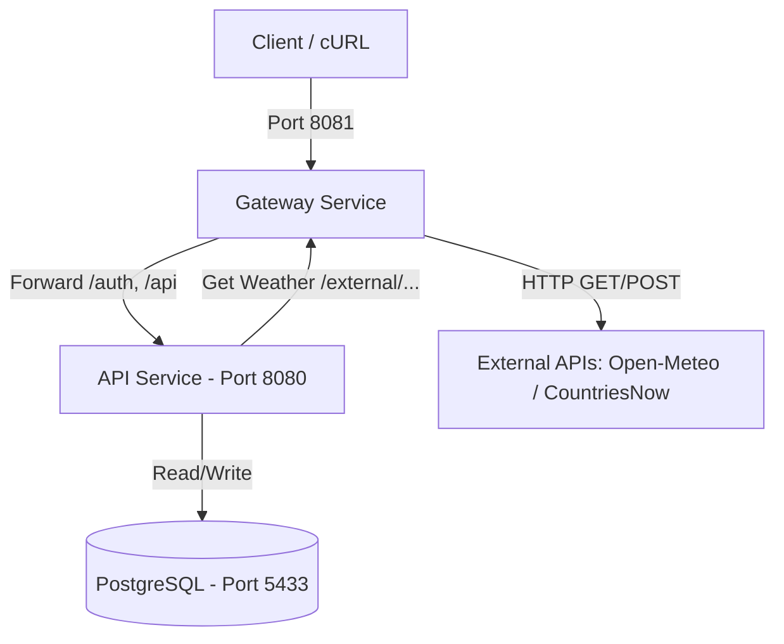

# Weather API (Microservices Version)

Проект разделен на 2 независимых микросервиса для обеспечения надежности, масштабируемости и безопасности:
1. **API Service** — основной бэкенд с бизнес-логикой, аутентификацией, базой данных PostgreSQL и REST API.
2. **Gateway Service** — API Gateway и прокси-шлюз, который принимает внешние запросы клиентов, проксирует их на `api-service`, а также инкапсулирует работу с внешними интернет API (Open-Meteo и CountriesNow) для предоставления внутренних данных о погоде.

## Стек

- **Go** (go-chi, sqlx, pgx)
- **PostgreSQL 16**
- **Docker & Docker Compose**
- **Zap** (Uber) для структурированного логирования
- **Testcontainers-go** для интеграционных тестов БД

---

## Архитектура и взаимодействие



1. **Единая точка входа**: Клиенты отправляют запросы на порт `8081` (Gateway Service).
2. **Маршрутизация и проксирование**: Gateway Service перенаправляет все стандартные API-запросы (`/auth/*`, `/api/*`, `/weather/city/*` и т.д.) во внутреннюю сеть Docker Compose на `api-service:8080` с помощью `httputil.ReverseProxy`.
3. **Изоляция внешних API**: `api-service` не ходит в интернет напрямую. Когда ему требуется погода или координаты городов, он вызывает эндпоинты Gateway Service по адресу `http://gateway-service:8081/external/...`. Gateway Service делает запросы во внешние API с настроенным таймаутом.
4. **Хранилище данных**: `api-service` сохраняет историю запросов и управляет пользователями в PostgreSQL.

---

## Структура проекта

```
weather-api/
├── docker-compose.yml              — общая конфигурация Docker Compose
│
├── api-service/                    — Сервис бизнес-логики и базы данных
│   ├── Dockerfile
│   ├── go.mod                      — модуль weather-api
│   ├── cmd/app/main.go             — точка входа API Service
│   ├── internal/                   — внутренняя логика (auth, config, handler, service, repository, client)
│   └── sql/                        — SQL скрипты инициализации БД
│
└── gateway-service/                — Сервис-шлюз и прокси внешних API
    ├── Dockerfile
    ├── go.mod                      — модуль weather-api/gateway-service
    ├── cmd/main.go                 — точка входа Gateway Service
    └── internal/client/            — клиент к внешним API Open-Meteo и CountriesNow
```

---

## Запуск проекта

Проект запускается одной командой из корня репозитория:

```bash
docker-compose up --build
```
*(Или `docker compose up --build` в зависимости от версии Docker CLI)*

После запуска будут работать:
- **API Service Health check**: `GET http://localhost:8080/health`
- **Gateway Service Health check**: `GET http://localhost:8081/health`
- **Все эндпоинты через Gateway**: `http://localhost:8081` (проксирует на API Service)
- **Прямой доступ к API Service (опционально)**: `http://localhost:8080`

---

## API Endpoints

Все запросы можно выполнять через шлюз на порту `8081`:

### Healthcheck

```bash
curl -i http://localhost:8081/health
```

### Auth (Аутентификация)

```bash
# Регистрация
curl -i -X POST http://localhost:8081/auth/register \
  -H "Content-Type: application/json" \
  -d '{"email":"user@test.com","password_hash":"pass","first_name":"Ivan","last_name":"Ivanov"}'

# Логин (получение JWT токена)
curl -i -X POST http://localhost:8081/auth/login \
  -H "Content-Type: application/json" \
  -d '{"email":"user@test.com","password":"pass"}'
```
В ответ вернется `token`. Передавайте его в заголовке `Authorization: Bearer <token>`.

### Управление городами пользователя (Защищено JWT)

```bash
# Добавить город
curl -i -X POST http://localhost:8081/api/v1/cities \
  -H "Authorization: Bearer <token>" \
  -H "Content-Type: application/json" \
  -d '{"city":"Almaty"}'

# Получить список городов
curl -i http://localhost:8081/api/v1/cities \
  -H "Authorization: Bearer <token>"
```

### Получение погоды

```bash
# Погода по всем добавленным городам пользователя (goroutines + WaitGroup)
curl -i http://localhost:8081/api/v1/weather \
  -H "Authorization: Bearer <token>"

# История погоды из PostgreSQL с пагинацией
curl -i "http://localhost:8081/api/v1/weather/history?city=Almaty&limit=5" \
  -H "Authorization: Bearer <token>"

# Публичные запросы погоды по названию города
curl -i http://localhost:8081/weather/city/Almaty
```

---

## Тестирование

### Unit-тесты и интеграционные тесты для API Service
Для интеграционных тестов требуется запущенный Docker daemon. Если вы используете Colima на macOS:
```bash
export DOCKER_HOST="unix://$HOME/.colima/default/docker.sock"
export TESTCONTAINERS_DOCKER_SOCKET_OVERRIDE=/var/run/docker.sock
```

Запуск тестов в `api-service`:
```bash
cd api-service
CGO_ENABLED=0 go test -v ./...
```

Запуск тестов в `gateway-service`:
```bash
cd gateway-service
go test -v ./...
```